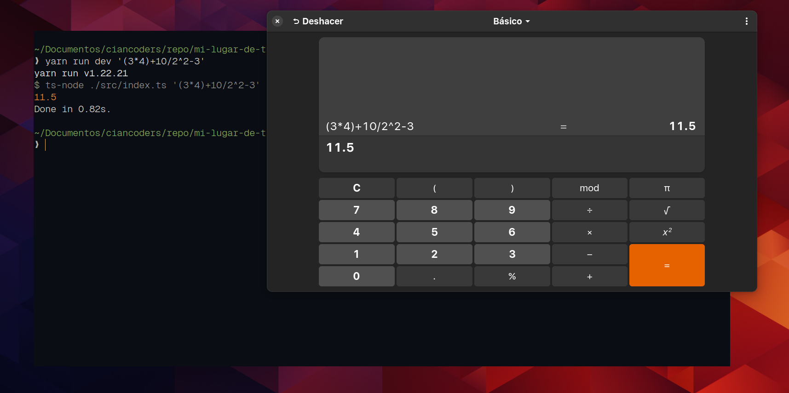

# Documentación calculadora

## Estructura del código:
El código se estructura de la siguiente manera:
~~~bash
src
├── clases
│   ├── Calculadora.ts
│   ├── ConvertidorInfijoSufijo.ts
│   ├── operaciones
│   │   ├── CreadorOperacion.ts
│   │   ├── Division.ts
│   │   ├── Multiplicacion.ts
│   │   ├── Pow.ts
│   │   ├── Resta.ts
│   │   ├── Sqrt.ts
│   │   └── Suma.ts
│   └── OperadorSufijo.ts
├── contratos
│   └── operaciones
│       └── IOperacion.ts
└── index.ts
~~~

### Directorio src:
Es el directorio raíz del código, contiene los siguientes directorios: clases y contratos. Además, contiene el archivo index.ts que es el punto de entrada principal del programa.

### Directorio clases:
Contiene las clases que permiten el funcionamiento de la calculadora(ConvertidorInfijoSufijo.ts, OperadorSufijo.ts y Calculadora.ts). Además contiene un directorio llamado operaciones que contiene las clases donde se definen las operaciones, los archivos del directorio operaciones son:

    * Suma.ts(operación suma)
    * Resta.ts(operación resta)
    * Multiplicacion.ts(operacion multiplicación)
    * Division.ts(operación división)
    * Sqrt.ts(operación raíz cuadrada)
    * Pow.ts(operación potencia)
    * CreadorOperacion.ts(permite crear una instancia de una operación en función del símbolo que se le pase por parámetro al método estático DevolverOperacion)


### Directorio contratos:
Contiene las interfaces utilizadas para resolver el problema. Contiene una sola interfaz en el archivo IOperacion.ts; está interfaz es implementada por las operaciones ubicadas en el directorio 'clases/operaciones' para poder definir un método llamado 'resolver' que es común a todas las operaciones.

## Algoritmo de la solución
Para solucionar este problema se ha implementado un algoritmo que consta de tres procesos principales que son:

1. convertir la operación recibida por argumento de consola en notación infija a sufija:

La lógica de este proceso se encuentra en el archivo 'clases/ConvertidorInfijoSufijo.ts'. Para lograr la conversión se debe de realizar los siguientes pasos:

Se deben definir dos pilas(una principal y una temporal), en la pila principal se van apilando los tokens(operandos y operadores) que ya están en el orden correcto y en la pila temporal se irán apilando los operadores para poder ordenarlos en el orden de la jerarquía de operaciones, el proceso funciona de la siguiente manera:

    * Leemos la operación en notación infija de izquierda a derecha y aplicamos las siguientes reglas:
        * Si es operando(número) se apila directamente en la pila principal
        * Si es operador y la pila temporal está vacía, se apila en la pila temporal
        * Si es operador y la pila temporal contiene operadores apilados, se evalúa de la siguiente manera:
            * Si el operador del tope de la pila es menor en jerarquía al operador que se está leyendo, entonces se apila en la pila temporal
            * Si el operador del tope es igual en jerarquía al operador que se esta leyendo, se desapila el operador del tope de la pila temporal, se apila en la pila principal y por último se apila en la pila temporal al operador que se esta leyendo
            * Si el operador del tope es mayor al operador que se está leyendo, entonces se vacía la pila temporal hasta que se encuentre un operador mayor o igual en jerarquía al operador que se está leyendo y todos los operadores desapilados se apilan a la pila principal, por último se apila en la pila temporal el operador que se está leyendo
        * Si es un paréntesis de apertura '(', se agrega a la pila temporal
        * Si es un paréntesis de cierre ')' se desapilan todos los operadores de la pila temporal hasta encontrar un paréntesis de apertura, los operadores desapilados se apilan a la pila principal(los paréntesis no se deben de apilar)
        
2. operar la operación en notación sufija

La lógica de este proceso se encuentra en el archivo 'clases/OperadorSufijo.ts'. Para resolver una operación matemática en notación sufija, se debe definir una pila y se deben de realizar los siguientes pasos:

    * leer de izquierda a derecha
    * si es operando agregar a la pila
    * si es operador sacar de la pila los dos operandos del tope y se realiza la operación, el resultado agregarlo al tope de la pila
    * Al finalizar la operación, solo habrá un número apilado en la pila que representará el resultado de la operación

3. Envolver la lógica de conversión de operación y proceso de operación en una clase llamada Calculadora:

La lógica de este proceso se encuentra en el archivo 'clases/Calculadora.ts' y se trata de una clase que depende de las clases ConvertidorInfijoSufijo y OperadorSufijo. Esta clase tiene como propósito envolver la lógica del algoritmo y poder tener más ordenado el código. En el archivo index.ts se encuentra una instancia de la clase Calculadora y a partir de ahí se realiza todo el proceso.

## Funcionamiento de la calculadora:

Para poder hacer uso del programa se debe de ejecutar el siguiente comando:

```bash
yarn run dev 'operacion matematica'
```

A continuación se muestran capturas de pantalla del funcionamiento del programa.




## Control de excepciones

Se controlan las excepciones que generan las siguientes entradas:

* Al ingresar una operación con más de 20 caracteres


* Al ingresar una operación inválida


* Al no ingresar una operación en los parámetros de la instrucción de terminal

